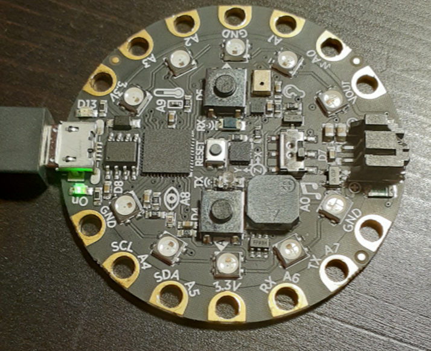
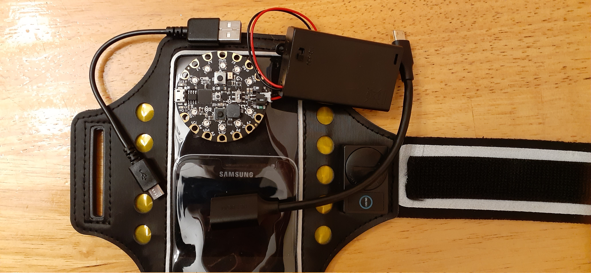
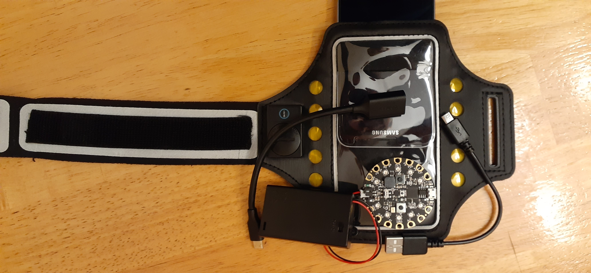

Leaning on my left side while sitting down is one of the many bad habits I have developed over the years which unfortunately resulted in a shoulder injury that has taken months to heal. 

Because I assume, I am far from being the only one with such a habits, I have written a short CircuitPython script using the VS Code CircuitPython extension inspired by Adafruit Carter Nelson's slouch detector to help prevent other from developing similar injuries.

The Circuit Playground Express (CPX) is a micro-controller, with several embedded sensors including an integrated accelerometer which calculates the angle of inclination and beeps once the threshold has been triggered. 

The angle can be adjusted based on the user's application. The script is portable to any microcontroller supporting circuitpython (see list here ) and is simple enough to easily be converted to lower level languages.

I have left a link to the github repository in the comment section for anyone to use and repurpose.

I hope many of you find this useful and look forward to hearing about your experience with your own version.

# Hardware
Circuit Playground Express or (Circuit Playground BlueFruit)
Power Source (Repurposed phone or AAA Battery Holder JST-PH)
Armband
Micro USB cable + Micro USB  to Female Adapter
or USB C cable + USB C to Female Adapter

